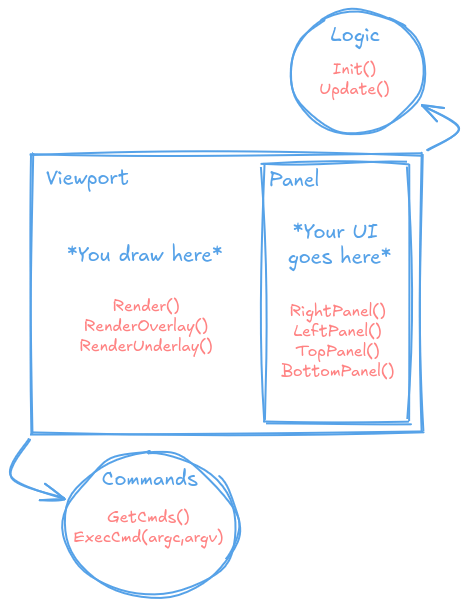

# Origami

Origami is a multi-viewport UI framework in C for building editor tools, built on top of [raylib](https://www.raylib.com/) and [microui](https://github.com/rxi/microui).


Features:
* Multiple independent viewports  
* Show/hide, dragging and resizing support for viewports  
* Z-order viewport stacking  
* Modal viewports  
* Built-in multiple UI panels per viewport via microui
* Panel resizing support  
* Per-viewport zoom and pan support  
* Custom overlay and underlay rendering per viewport  
* Per-viewport argc/argv-style command interface  
* On-screen logging support  
* Callback-based API (update, render, UI, etc.)  

## Build

Origami depends on raylib and requires it to be installed. Static linking is recommended.  
When cloning this repo, make sure to also initialize and update submodules:
```bash
git clone --recurse-submodules https://github.com/SuckDuck/origami
```

To build everything, run the following:

```bash
make         # Build the resources
make example # Build the example - optional
```

Integrating Origami into another project:
1. Add Origami as a git submodule
1. Build the resources as above
1. Include `src` in your list of source files.
1. Add `include` and `statics` to your include paths.

<br>

Origami includes [LittleBuild](https://github.com/SuckDuck/littlebuild) as a submodule, which is used to build the resources and the example. You can also use it to compile your own project. If you do, you can import the origami build functions like this:

```python
import origami.build as origami
```

Then you can build Origami alongside your project from the same place.

## Usage

Before using Origami, it’s recommended to read the [microui usage guide](https://github.com/rxi/microui/blob/master/doc/usage.md).  
Also, see the example in this repository.

Origami has two main components: Command Bar and Viewports.

- **Command Bar** – A small command-line interface that opens with a shortcut (Shift + enter, by default).  
Used to run commands and initially to open viewports.  
- **Viewports** – Independent windows. They are the **central part of Origami** and have 4 parts:  
  1. **Logic callbacks** – Callbacks for viewport logic, like `Init()` and `Update()`.
  1. **Render callbacks** – `Render()`, `RenderOverlay()`, and `RenderUnderlay()`.  
  1. **Panels callbacks** – Units attached to a viewport where UI elements (microui) can be placed.  
  1. **Commands interface** – argc/argv-style interface run from the Command Bar. Each viewport can have custom commands.  
  



The general usage workflow looks like this:

- Register your viewports and their callbacks using `OG_InitViewport()`.  
It’s recommended to wrap this in a helper function for each viewport, as the function signature is long.  
- Call `OG_Init()` after registering all viewports.  
- In your main loop, call `OG_Update()`.  
- Call `OG_Free()` at the end of your application.

So your whole `main()` function can look like this:

```C
int main(int argc, char **argv){
    
    // Viewports init functions
    Viewport0();
    Viewport1();
    
    OG_Init("origami_example", 60);
    while (true) {
        if (OG_Update())
            break;
    }

    OG_Free();
    return 0;
}
```

For an example of how to register a viewport and use its callbacks, please see the [example included in this repository](example/).